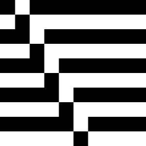

# Cellular Automata 

https://justingolden.me/cellular-automata/

Explore all 256 rules of 1D cellular automata

- Enter a rule number to view its cellular automata

- Change the grid size and square size

- Link to a specific rule number for easy sharing : )

More reading: https://mathworld.wolfram.com/ElementaryCellularAutomaton.html

##### Credits

Wolfram's classifications from https://arxiv.org/pdf/1306.5577.pdf, patterns from https://www.heropatterns.com

##### Links for nerds

- https://plato.stanford.edu/entries/cellular-automata/

- https://towardsdatascience.com/algorithmic-beauty-an-introduction-to-cellular-automata-f53179b3cf8f

- https://www.sciencedirect.com/topics/computer-science/cellular-automata

- https://writings.stephenwolfram.com/2017/06/oh-my-gosh-its-covered-in-rule-30s/

- https://en.wikipedia.org/wiki/Cellular_automaton

- https://natureofcode.com/book/chapter-7-cellular-automata/

##### By Justin Golden

https://justingolden.me

https://github.com/justingolden21/

justingolden21@gmail.com
